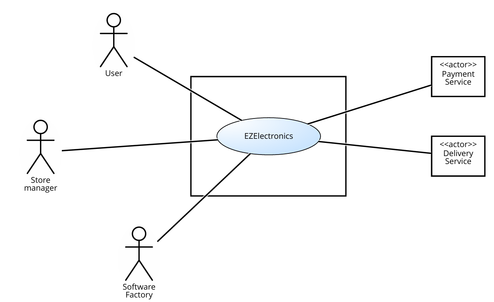

# Requirements Document - current EZElectronics

Date:

Version: V1 - description of EZElectronics in CURRENT form (as received by teachers)

| Version number | Change |
| :------------: | :----: |
|                |        |

# Contents

- [Requirements Document - current EZElectronics](#requirements-document---current-ezelectronics)
- [Contents](#contents)
- [Informal description](#informal-description)
- [Stakeholders](#stakeholders)
- [Context Diagram and interfaces](#context-diagram-and-interfaces)
  - [Context Diagram](#context-diagram)
  - [Interfaces](#interfaces)
- [Stories and personas](#stories-and-personas)
- [Functional and non functional requirements](#functional-and-non-functional-requirements)
  - [Functional Requirements](#functional-requirements)
  - [Non Functional Requirements](#non-functional-requirements)
- [Use case diagram and use cases](#use-case-diagram-and-use-cases)
  - [Use case diagram](#use-case-diagram)
    - [Use case 1, UC1](#use-case-1-uc1)
        - [Scenario 1.1](#scenario-11)
        - [Scenario 1.2](#scenario-12)
        - [Scenario 1.x](#scenario-1x)
    - [Use case 2, UC2](#use-case-2-uc2)
    - [Use case x, UCx](#use-case-x-ucx)
- [Glossary](#glossary)
- [System Design](#system-design)
- [Deployment Diagram](#deployment-diagram)

# Informal description

EZElectronics (read EaSy Electronics) is a software application designed to help managers of electronics stores to manage their products and offer them to customers through a dedicated website. Managers can assess the available products, record new ones, and confirm purchases. Customers can see available products, add them to a cart and see the history of their past purchases.

# Stakeholders

| Stakeholder name | Description |
| :--------------: | :---------: |
| Customer  | User that can buy products            |
| Store Manager  | User that sells products            |
| Payment service  | Used to manage transactions            |
| Delivery service  | Used to manage deliveries            |
| Software Factory  |  Delopers and mainteiners of the applications          |

# Context Diagram and interfaces

## Context Diagram

\<Define here Context diagram using UML use case diagram>

\<actors are a subset of stakeholders>

## Interfaces

\<describe here each interface in the context diagram>

\<GUIs will be described graphically in a separate document>

|   Actor   | Logical Interface | Physical Interface |
| :-------: | :---------------: | :----------------: |
| Customer  |      GUI          |     PC /  Smartphone|
| Store Manager | GUI | PC / Smartphone|
| Payment Service | https://developer.paypal.com/docs/payouts/standard/integrate-api/ | Internet |
| Delivery Service |BRT EasySpedWeb | Internet
| Software Factory ???

# Stories and personas

\<A Persona is a realistic impersonation of an actor. Define here a few personas and describe in plain text how a persona interacts with the system>

\<Persona is-an-instance-of actor>

\<stories will be formalized later as scenarios in use cases>

# Functional and non functional requirements

## Functional Requirements

\<In the form DO SOMETHING, or VERB NOUN, describe high level capabilities of the system>

\<they match to high level use cases>

|  ID   | Description |
| :---: | :---------: |
|  FR1  |     Gestione Transazione   |
|  FR1.1  |   Richiesta pagamento       |
| FR1.2 | Gestione dati di pagamento            |
| FR2 | Gestione carrello             |
| FR2.1 | Aggiungi/Rimuovi elemento  dal carrello             |
| FR2.2 | Cambiamento quantità elemento del carrello             |
| FR2.3 | Svuota carrello             |
| FR3 | Gestione articolo in vendita|
| FR3.1 | Aggiunta/Rimozione articolo|
| FR3.2 | Modifica prezzo|
| FR3.3 | Modifica descrizione|
| FR4| Gestione Account |
| FR4.1| Registrazione account|
| FR4.2| Chiusura account|
| FR4.3| Login/Logout utenti|
|FR4.5 | Aggiunta indirizzo default|
| FR5| Gestione ordini |
| FR5.1|  Mostra ordini|
| FR5.2|  Download fattura|
| FR5.3| Status ordine |
| FR5.4| Filtri ordine|
| FR5.5| Assistenza ordine |
| FR6| Gestione privacy|
| FR6.1 | Mostra cookie policy|
| FR6.2 | GDPR privacy policy requirements|
| FR7| Checkout ordine |
| FR7.1| Riepilogo lista articoli|
| FR7.2| Selezione indirizzo di spedizione |
| FR7.2.1| Selezione indirizzo di default|
| FR7.2.2| Selezione indirizzo temporaneo |
| FR8| Sezione esito| 
| FR8.1 | Mostra esito| 
| FR8.2 | Vai a redirect| 
| FR9 | Visualizza prodotti| 
| FR9.1 | Ricerca prodotti| 
| FR9.2 | Filtra prodotti| 
| FR9.3 | Dettaglio prodotto| 

## Non Functional Requirements

\<Describe constraints on functional requirements>

|   ID    | Type (efficiency, reliability, ..) | Description | Refers to |
| :-----: | :--------------------------------: | :---------: | :-------: |
|  NFR1   | Usabilità                               | Utenti non hanno bisogno di training            |           |
|  NFR2   | Efficienza                                    | Tempo di risposta del server inferiore a 0.2s            |           |
|  NFR3   | Affidabilità                                   | Sito non deve essere offline per più di 7gg all'anno           |           |
| NFR4  | Usabilità                                   | La sessione deve essere mantenuta attiva almeno 5 ore          |           |
| NFR5  |   Correttezza                                 | Test Coverage 80%  |           |
| NFR6  |   Portabilità                             | Chrome: 97.0.4692.99, Firefox:  96.0.1, Safari: 15.1|           |
| NFR7  |  Portabilità                           | Il sito deve essere responsive per schermi che vanno da 360x720 a 3840x2160 |           |
| NFR8  |  Manutenibilità | 8 ore/persona necessarie per sistemare un malfunzionamento |           |
| NFR9 |  Manutenibilità | 20 ore/persona necessarie per tempistiche di deploy per una nuova versione|           |
| NFR10 |  Sicurezza | La password deve rispettare le seguenti caratteristiche: lunghezza minima 8 caratteri, carattere speciale, carattere maiuscolo, numero |           |
| NFR11 |  Sicurezza | Le password devono essere salvate sul database con un algoritmo di hashing salted|           |
| NFR12 |  Sicurezza | Utilizzo del protocollo https|           |

# Use case diagram and use cases

## Use case diagram

\<define here UML Use case diagram UCD summarizing all use cases, and their relationships>

\<next describe here each use case in the UCD>

### Use case 1, UC1

| Actors Involved  |                                                                      |
| :--------------: | :------------------------------------------------------------------: |
|   Precondition   | \<Boolean expression, must evaluate to true before the UC can start> |
|  Post condition  |  \<Boolean expression, must evaluate to true after UC is finished>   |
| Nominal Scenario |         \<Textual description of actions executed by the UC>         |
|     Variants     |                      \<other normal executions>                      |
|    Exceptions    |                        \<exceptions, errors >                        |

##### Scenario 1.1

\<describe here scenarios instances of UC1>

\<a scenario is a sequence of steps that corresponds to a particular execution of one use case>

\<a scenario is a more formal description of a story>

\<only relevant scenarios should be described>

|  Scenario 1.1  |                                                                            |
| :------------: | :------------------------------------------------------------------------: |
|  Precondition  | \<Boolean expression, must evaluate to true before the scenario can start> |
| Post condition |  \<Boolean expression, must evaluate to true after scenario is finished>   |
|     Step#      |                                Description                                 |
|       1        |                                                                            |
|       2        |                                                                            |
|      ...       |                                                                            |

##### Scenario 1.2

##### Scenario 1.x

### Use case 2, UC2

..

### Use case x, UCx

..

# Glossary

\<use UML class diagram to define important terms, or concepts in the domain of the application, and their relationships>

\<concepts must be used consistently all over the document, ex in use cases, requirements etc>

# System Design

\<describe here system design>

\<must be consistent with Context diagram>

# Deployment Diagram

\<describe here deployment diagram >
