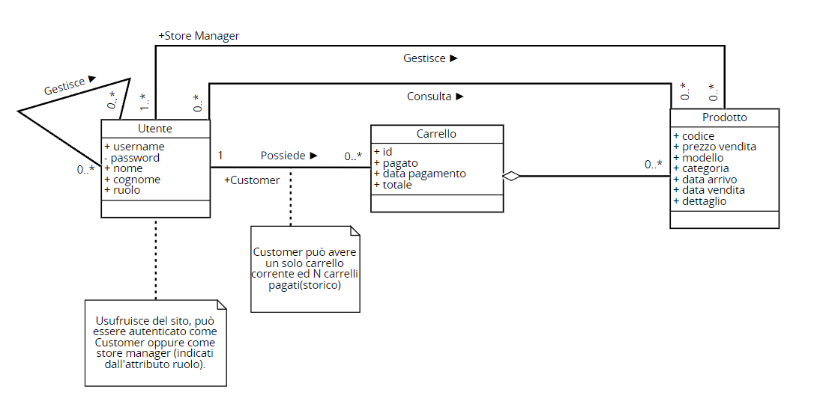
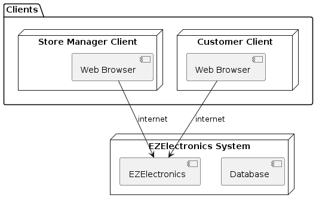

# Requirements Document - current EZElectronics

Date:

Version: V1 - description of EZElectronics in CURRENT form (as received by teachers)

| Version number | Change |
| :------------: | :----: |
|                |        |

# Contents

- [Requirements Document - current EZElectronics](#requirements-document---current-ezelectronics)
- [Contents](#contents)
- [Informal description](#informal-description)
- [Stakeholders](#stakeholders)
- [Context Diagram and interfaces](#context-diagram-and-interfaces)
  - [Context Diagram](#context-diagram)
  - [Interfaces](#interfaces)
- [Stories and personas](#stories-and-personas)
- [Functional and non functional requirements](#functional-and-non-functional-requirements)
  - [Functional Requirements](#functional-requirements)
  - [Non Functional Requirements](#non-functional-requirements)
- [Use case diagram and use cases](#use-case-diagram-and-use-cases)
  - [Use case diagram](#use-case-diagram)
    - [Use case 1, Aggiunta prodotto carrello](#use-case-1-aggiunta-prodotto-carrello)
        - [Scenario 1.1](#scenario-11)
        - [Scenario 1.2](#scenario-12)
        - [Scenario 1.3](#scenario-13)
    - [Use case 2, Rimozione prodotto Carrello](#use-case-2-rimozione-prodotto-carrello)
        - [Scenario 2.1](#scenario-21)
        - [Scenario 2.2](#scenario-22)
        - [Scenario 2.3](#scenario-23)
    - [Use case 3, Eliminazione Carrello](#use-case-3-eliminazione-carrello)
        - [Scenario 3.1](#scenario-31)
        - [Scenario 3.2](#scenario-32)
    - [Use case 4, Checkout Carrello](#use-case-4-checkout-carrello)
        - [Scenario 4.1](#scenario-41)
        - [Scenario 4.2](#scenario-42)
        - [Scenario 4.3](#scenario-43)
    - [Use case 5, Mostra carrello](#use-case-5-mostra-carrello)
      - [Scenario 5.1](#scenario-51)
    - [Use case 6, Registrazione arrivo prodotti](#use-case-6-registrazione-arrivo-prodotti)
        - [Scenario 6.1](#scenario-61)
        - [Scenario 6.2](#scenario-62)
    - [Use case 7, Eliminazione prodotto](#use-case-7-eliminazione-prodotto)
        - [Scenario 7.1](#scenario-71)
        - [Scenario 7.2](#scenario-72)
    - [Use case 8, Conferma vendita prodotto](#use-case-8-conferma-vendita-prodotto)
        - [Scenario 8.1](#scenario-81)
        - [Scenario 8.2](#scenario-82)
        - [Scenario 8.3](#scenario-83)
    - [Use case 9, Ricerca prodotti](#use-case-9-ricerca-prodotti)
        - [Scenario 9.1](#scenario-91)
        - [Scenario 9.2](#scenario-92)
    - [Use case 10, Filtra prodotti](#use-case-10-filtra-prodotti)
        - [Scenario 10.1](#scenario-101)
        - [Scenario 10.2](#scenario-102)
    - [Use case 11, Crea e registra nuovo prodotto](#use-case-11-crea-e-registra-nuovo-prodotto)
        - [Scenario 11.1](#scenario-111)
        - [Scenario 11.2](#scenario-112)
        - [Scenario 11.3](#scenario-113)
    - [Use case 12, Mostra prodotti](#use-case-12-mostra-prodotti)
        - [Scenario 12.1](#scenario-121)
        - [Scenario 12.2](#scenario-122)
    - [Use case 13, Registrazione utente](#use-case-13-registrazione-utente)
        - [Scenario 13.1](#scenario-131)
        - [Scenario 13.2](#scenario-132)
    - [Use case 14, Login](#use-case-14-login)
        - [Scenario 14.1](#scenario-141)
        - [Scenario 14.2](#scenario-142)
    - [Use case 15, Logout](#use-case-15-logout)
        - [Scenario 15.1](#scenario-151)
    - [Use case 16, Eliminazione utente](#use-case-16-eliminazione-utente)
        - [Scenario 16.1](#scenario-161)
        - [Scenario 16.2](#scenario-162)
    - [Use case 17, Filtra utenti](#use-case-17-filtra-utenti)
        - [Scenario 17.1](#scenario-171)
        - [Scenario 17.2](#scenario-172)
        - [Scenario 17.3](#scenario-173)
    - [Use case 18, Mostra utenti](#use-case-18-mostra-utenti)
        - [Scenario 18.1](#scenario-181)
    - [Use case 19, Mostra informazioni utente corrente](#use-case-19-mostra-informazioni-utente-corrente)
        - [Scenario 19.1](#scenario-191)
    - [Use case 20, Storico carrelli](#use-case-20-storico-carrelli)
        - [Scenario 20.1](#scenario-201)
        - [Scenario 20.2](#scenario-202)
    - [Use case 21, Rimozione carrello](#use-case-21-rimozione-carrello)
        - [Scenario 21.1](#scenario-211)
        - [Scenario 21.2](#scenario-212)
- [Glossary](#glossary)
- [System Design](#system-design)
- [Deployment Diagram](#deployment-diagram)

# Informal description

EZElectronics (read EaSy Electronics) is a software application designed to help managers of electronics stores to manage their products and offer them to customers through a dedicated website. Managers can assess the available products, record new ones, and confirm purchases. Customers can see available products, add them to a cart and see the history of their past purchases.

# Stakeholders

| Stakeholder name | Description |
| :--------------: | :---------: |
| Customer  |  Utente che acquista i prodotti     |
| Store Manager  | Utente che gestisce l'inventario e conferma gli ordini           |
| Payment service  | Utilizzato per gestire le transazioni            |
| Software Factory  |  Programmatori e manutentori del sistema          |

# Context Diagram and interfaces

## Context Diagram

\<Define here Context diagram using UML use case diagram>

\<actors are a subset of stakeholders>

## Interfaces

\<describe here each interface in the context diagram>

\<GUIs will be described graphically in a separate document>

|   Actor   | Logical Interface | Physical Interface |
| :-------: | :---------------: | :----------------: |
| Customer  |      GUI          |     PC /  Smartphone|
| Store Manager | GUI | PC / Smartphone|
| Payment Service | https://developer.paypal.com/docs/payouts/standard/integrate-api/ | Internet |

# Stories and personas

Marco è un ragazzo di 25 anni che vuole comprare componenti per assemblare un pc. Nella ricerca per pezzi a prezzi convenienti, ha scoperto il sito EZElectronics grazie a un suo collega. Marco ha eseguito la procedura di registrazione come cliente e, dopo aver fatto accesso al sito e aver navigato per circa un' ora, trova e acquista i componenti necessari, da ritirare in negozio.

Emma è una donna 30 anni che lavora come manager per lo store online di EZElectronics. Nella sua giornata gestisce il sito, ad esempio aggiungendo i prodotti non appena arrivano e confermare le vendite.

\<Persona is-an-instance-of actor>

\<stories will be formalized later as scenarios in use cases>

# Functional and non functional requirements

## Functional Requirements

\<In the form DO SOMETHING, or VERB NOUN, describe high level capabilities of the system>

\<they match to high level use cases>

|  ID   | Description |
| :---: | :---------: |
| FR1 | Gestione carrello |
| FR1.1 | Aggiungi prodotto| 
| FR1.2 | Elimina carrello corrente | 
| FR1.3 | Checkout carrello | 
| FR1.4 | Mostra carrello | 
| FR1.5 | Rimuovi prodotto| 
| FR2 | Gestione prodotti| 
| FR2.1 | Ricerca prodotto| 
| FR2.2 | Filtra prodotti (categoria, modello, sold)| 
| FR2.3 | Mostra prodotti | 
| FR2.4 | Crea prodotto | 
| FR2.5 | Conferma vendita prodotto | 
| FR2.6 | Eliminazione prodotto | 
| FR2.7 | Registra arrivo prodotti dello stesso modello| 
| FR3| Gestione Account |
| FR3.1| Creazione utente| 
| FR3.2| Eliminazione utente| 
| FR3.3| Login utenti| 
| FR3.4| Filtra utenti| 
| FR3.5| Mostra lista utenti| 
| FR3.6| Mostra utente loggato| 
| FR3.7| Ricerca utente| 
| FR3.8| Logout utente| 
| FR4| Gestione ordini |
| FR4.1| Mostra storico ordini/carrelli pagati| 

## Non Functional Requirements

\<Describe constraints on functional requirements>

|   ID    | Type (efficiency, reliability, ..) | Description | Refers to |
| :-----: | :--------------------------------: | :---------: | :-------: |
|  NFR1 | Usabilità | Utenti non hanno bisogno di training | FR3 |
| NFR2 | Usabilità | La sessione deve essere mantenuta attiva almeno 12 ore |    FR3       |
| NFR3 |   Portabilità | Chrome: 97.0.4692.99, Firefox:  96.0.1, Safari: 15.1|      FR1,FR2,FR3,FR4     |
| NFR4 |  Portabilità | Il sito deve essere responsive per schermi che vanno da 360x720 pixels a 3840x2160 pixels |    FR1,FR2,FR3,FR4       |
| NFR5 | Sicurezza | Le password devono essere salvate sul database con un algoritmo di hashing salted|   FR3        | 

# Use case diagram and use cases

Per gli use case: mostra utenti, eliminazione utente e filtra utenti si è seguito alla lettera il documento di riferimento delle API, pertanto si è permesso l'accesso alle suddette funzionalità senza requisiti di login specifici, anche se sarebbe opportuno considerarne l'utilizzo solo per utenti autenticati come store manager.

## Use case diagram

\<define here UML Use case diagram UCD summarizing all use cases, and their relationships>

\<next describe here each use case in the UCD>

### Use case 1, Aggiunta prodotto carrello

| Actors Involved  |        Cliente                                                             |
| :--------------: | :------------------------------------------------------------------: |
|   Precondition   | Utente loggato come cliente |
|  Post condition  | prodotto aggiunto al carrello |
| Nominal Scenario |        utente aggiunge un elemento al carrello         |
|     Variants     |    -           |
|    Exceptions    | il prodotto non esiste (Error 404),il prodotto non è disponibile (venduto o in un altro carrello) (Error 409)                       |

##### Scenario 1.1

\<describe here scenarios instances of UC1>

\<a scenario is a sequence of steps that corresponds to a particular execution of one use case>

\<a scenario is a more formal description of a story>

\<only relevant scenarios should be described>

|  Scenario 1.1  |                                                                            |
| :------------: | :------------------------------------------------------------------------: |
|  Precondition  | Utente autenticato come cliente |
| Post condition |  Aggiunta elemento al carrello|
|     Step#      |                                Description                                 |
|       1        |      Il sito mostra la lista dei prodotti                                                                   |
|       2        |        L'utente inserisce un prodotto nel carrello                                                                    |
|      3       |            Il sistema aggiorna il carrello                                                        |

##### Scenario 1.2

|  Scenario 1.2  |                                                                            |
| :------------: | :------------------------------------------------------------------------: |
|  Precondition  | Utente autenticato come cliente |
| Post condition |  Lancio errore 404|
|     Step#      |                                Description                                 |
|       1      |      Il sito mostra la lista dei prodotti                                                                   |
|       2      |        L'utente inserisce un prodotto nel carrello                   |
|      3       |            Il sistema ritorna un messaggio 404 perchè il prodotto non esiste  |

##### Scenario 1.3

|  Scenario 1.3  |                                                                            |
| :------------: | :------------------------------------------------------------------------: |
|  Precondition  | Utente autenticato come cliente |
| Post condition |  Lancio errore 409 |
|     Step#      |                                Description                                 |
|       1        |      Il sito mostra la lista dei prodotti                                                                   |
|       2        |        L'utente inserisce un prodotto nel carrello                                                                    |
|      3       |            Il sistema ritorna un messaggio 409 perchè il prodotto non è disponibile (venduto o in un altro carrello)   |

### Use case 2, Rimozione prodotto Carrello

| Actors Involved  |         Utente                                                             |
| :--------------: | :------------------------------------------------------------------: |
|   Precondition   | Utente loggato come cliente, carrello con un elemento |
|  Post condition  |  Elemento rimosso dal carrello |
| Nominal Scenario |         Rimozione di un elemento dal carrello         |
|     Variants     |     -        |
|    Exceptions    |    codice prodotto non presente nel carrello (ERROr 404), carrello non esistente (ERROR 404), codice prodotto insesistente (ERROR 409), codice prodotto di un prodotto già venduto (ERROR 409)                       |

##### Scenario 2.1

|  Scenario 2.1  |                                                                            |
| :------------: | :------------------------------------------------------------------------: |
|  Precondition  | Carrello con almeno un elemento, Utente autenticato come cliente |
| Post condition |  Rimozione elemento dal carrello|
|     Step#      |                                Description                                 |
|       1        |      L'utente   apre il carrello                                                           |
|       2        |      Il sistema mostra il carrello                                         |
|       3        |        L'utente chiede di rimuovere un prodotto                                                                    |
|      4       |            Il sistema aggiorna il carrello                                                         |

##### Scenario 2.2

|  Scenario 2.2  |                                                                            |
| :------------: | :------------------------------------------------------------------------: |
|  Precondition  | Utente autenticato come cliente |
| Post condition |  Lancio Errore 404 |
|     Step#      |                                Description                                 |
|       1        |      L'utente   apre il carrello                                                           |
|       2        |      Il sistema mostra il carrello                                         |
|       3        |        L'utente chiede di rimuovere un prodotto                                                                    |
|      4       |            Il sistema lancia l'errore 404 (prodotto non nel carrello, prodotto e/o carrello non esistente)           |

##### Scenario 2.3

|  Scenario 2.3  |                                                                            |
| :------------: | :------------------------------------------------------------------------: |
|  Precondition  | Carrello con almeno un elemento, Utente autenticato come cliente |
| Post condition |  Lancio Errore 409|
|     Step#      |                                Description                                 |
|       1        |      L'utente   apre il carrello                                                           |
|       2        |      Il sistema chiede di rimuovere un prodotto                                        |
|       3        |        L'utente rimuove un elemento                                                                    |
|      4       |            Il sistema lancia l'errore 409 (prodotto già venduto)                                                         |

### Use case 3, Eliminazione Carrello

| Actors Involved  |         Utente                                                             |
| :--------------: | :------------------------------------------------------------------: |
|   Precondition   | Utente autenticato come cliente   |
|  Post condition  |  Carrello eliminato|
| Nominal Scenario | Utente richiede di eliminare il carello corrente         |
|     Variants     |        -|
|    Exceptions    |                  Carrello non esistente (Error 404)|

##### Scenario 3.1

|  Scenario 3.1  |                                                                            |
| :------------: | :------------------------------------------------------------------------: |
|  Precondition  | Utente possiede un carrello, Utente autenticato come cliente|
| Post condition |  Carrello eliminato |
|     Step#      |                                Description                                 |
|       1        |      L'utente   apre il carrello                                                           |
|       2        |      Il sistema mostra il carrello                                         |
|       3        |        L'utente richiede eliminazione del carrello                                                               |
|      4       |            Il sistema elimina il carrello                                                         |

##### Scenario 3.2

|  Scenario 3.2  |                                                                            |
| :------------: | :------------------------------------------------------------------------: |
|  Precondition  | Utente autenticato come cliente|
| Post condition | Errore 404 |
|     Step#      |                                Description                                 |
|       1        |      L'utente   apre il carrello                                                           |
|       2        |      Il sistema mostra il carrello                                         |
|       3        |        L'utente richiede eliminazione del carrello                                                               |
|      4       |            Il sistema lancia l'errore 404                                                        |

### Use case 4, Checkout Carrello
| Actors Involved  |         Cliente                                                             |
| :--------------: | :------------------------------------------------------------------: |
|   Precondition   | Utente autenticato come Cliente|
|  Post condition  |  Checkout effettuato   |
| Nominal Scenario | Cliente fa il checkout del carrello         |
|     Variants     |   -   |
|    Exceptions    |   Il carrello non esiste(Error 404), carrello vuoto (ERROR 404)                      |

##### Scenario 4.1

|  Scenario 4.1  |                                                                            |
| :------------: | :------------------------------------------------------------------------: |
|  Precondition  | Carrello con almeno un elemento, Utente autenticato come cliente|
| Post condition |  Checkout effettuato con successo|
|     Step#      |                                Description                                 |
|       1        |      L'utente   apre il carrello                                                           |
|       2        |      Il sistema mostra il carrello                                         |
|       3        |        L'utente richiede checkout del carrello                                                               |
|      4       |            Il sistema effettua il checkout del carrello con successo                                             |

##### Scenario 4.2

|  Scenario 4.2  |                                                                            |
| :------------: | :------------------------------------------------------------------------: |
|  Precondition  | Carrello vuoto, Utente autenticato come cliente|
| Post condition |  Checkout non riuscito|
|     Step#      |                                Description                                 |
|       1        |      L'utente   apre il carrello                                                           |
|       2        |      Il sistema mostra il carrello                                         |
|       3        |        L'utente richiede checkout del carrello                                                               |
|      4       |            Il sistema lancia l'errore 404 perchè il carrello è vuoto                         |

##### Scenario 4.3

|  Scenario 4.3  |                                                                            |
| :------------: | :------------------------------------------------------------------------: |
|  Precondition  | Carrello con almeno un elemento, Utente autenticato come cliente|
| Post condition |  Checkout effettuato con successo|
|     Step#      |                                Description                                 |
|       1        |      L'utente   apre il carrello                                                           |
|       2        |      Il sistema mostra il carrello                                         |
|       3        |        L'utente richiede checkout del carrello                                                               |
|      4       |  Il sistema lancia l'errore 404 (carrello insesistente)                                       |

### Use case 5, Mostra carrello

| Actors Involved  |         Customer                                                            |
| :--------------: | :------------------------------------------------------------------: |
|   Precondition   | Utente loggato come customer|
|  Post condition  | carrello dal sistema |
| Nominal Scenario | Sitstema mostra carrello dell'utente corrente          |
|     Variants     |        -          |
|    Exceptions    |               |

#### Scenario 5.1

|  Scenario 5.1  |                                                                            |
| :------------: | :------------------------------------------------------------------------: |
|  Precondition  | utente loggato come customer|
| Post condition | carrello mostrato dal sistema|
|    1   |       customer richiede di visualizzare il carrello |
|    2   |            Sistema mostra il carrello |

### Use case 6, Registrazione arrivo prodotti

| Actors Involved  |  Store Manager |
| :--------------: | :------------------------------------------------------------------: |
|   Precondition   | Utente autenticato come Store Manager |
|  Post condition  | Prodotti registrati all'interno del sistema |
| Nominal Scenario |Store manager registra più prodotti dello stesso modello       |
|     Variants     | - |
|    Exceptions    | inserimento data di arrivo dopo quella corrente |

##### Scenario 6.1

|  Scenario 6.1  |                                                                            |
| :------------: | :------------------------------------------------------------------------: |
|  Precondition  | utente loggato come store manager|
| Post condition |  Registrazione prodotti con molteplicitá > 1 |
|       1        |        Store manager chiede di registrare nuovi arrivi |
|      2       |            Sistema mostra form di inserimento data di arrivo |
|      3       |            Store manager inserisce data di arrivo |
|      4       |            Il sistema registra data di arrivo relativa ai prodotti interessati |

##### Scenario 6.2

|  Scenario 6.2  |                                                                            |
| :------------: | :------------------------------------------------------------------------: |
|  Precondition  | Store manager loggato|
| Post condition |  sistema mostra errore |
|       1       |        Store manager chiede di registrare nuovi arrivi |
|      2       |            Sistema mostra form di inserimento data di arrivo |
|      3       |            Store manager inserisce data/e di arrivo |
|      4       |            Il sistema mostra errore perchè la data di arrivo è dopo la data odierna |

### Use case 7, Eliminazione prodotto

| Actors Involved  |  Store Manager |
| :--------------: | :------------------------------------------------------------------: |
|   Precondition   | Utente autenticato come Store Manager |
|  Post condition  | Prodotto eliminato dal sistema |
| Nominal Scenario | Store manager elimina prodotto dal sistema        |
|     Variants     | -  |
|    Exceptions    | Codice prodtto da eliminare non esistente (ERROR 404) |

##### Scenario 7.1

|  Scenario 7.1  |                                                                            |
| :------------: | :------------------------------------------------------------------------: |
|  Precondition  | Store manager loggato|
| Post condition |  Prodotto eliminato |
|       1        |  Sistema mostra elenco prodotti |
|       2        |  Store manager seleziona 'elimina' accanto al prodotto che desidera eliminare |
|      3       |  Sistema chiede conferma dell'operazione |
|      4       |  Store manager conferma l'operazione |
|      5       |  Sistema elimina il prodotto dall'elenco |

##### Scenario 7.2

|  Scenario 7.2  |                                                                            |
| :------------: | :------------------------------------------------------------------------: |
|  Precondition  | Store manager loggato|
| Post condition |  Sistema mostra errore |
|       1        |  Sistema mostra elenco prodotti |
|       2        |  Store manager seleziona 'elimina' accanto al prodotto che desidera eliminare |
|      3       |  Sistema chiede conferma dell'operazione |
|      4       |  Store manager conferma l'operazione |
|      5       |  Sistema mostra errore 404  |

### Use case 8, Conferma vendita prodotto

| Actors Involved  |  Store Manager |
| :--------------: | :------------------------------------------------------------------: |
|   Precondition   | Utente autenticato come Store Manager |
|  Post condition  | Prodotto segnato come venduto |
| Nominal Scenario | Store manager conferma vendita prodotto     |
|     Variants     | -   |
|    Exceptions    | il codice prodotto non esiste (ERROR 404), data di vendita dopo data corrente, data di vendita antecedente alla data di arrivo, il prodotto è gia stato venduto|

##### Scenario 8.1

|  Scenario 8.1  |                                                                            |
| :------------: | :------------------------------------------------------------------------: |
|  Precondition  | Store manager loggato|
| Post condition |  Vendita prodotto confermata |
|       1        |  Store manager chiede di segnare un prodotto come venduto |
|      2       |  Sistema aggiorna lo stato del prodotto |

##### Scenario 8.2

|  Scenario 8.2 |                                                                            |
| :------------: | :------------------------------------------------------------------------: |
|  Precondition  | Store manager loggato|
| Post condition |  sistema mostra errore (404) |
|       1        |  Store manager chiede di segnare un prodotto come venduto |
|      2       |  Sistema mostra errore(404) |

##### Scenario 8.3

|  Scenario 8.3 |                                                                            |
| :------------: | :------------------------------------------------------------------------: |
|  Precondition  | Store manager loggato|
| Post condition |  sistema mostra errore |
|       1        |  Store manager chiede di segnare un prodotto come venduto |
|      2       |  Sistema mostra errore (data di vendita antecedente quella di arrivo, data di vendita dopo quella corrente, il prodotto è gia stato venduto) |

### Use case 9, Ricerca prodotti

| Actors Involved  |  Utente |
| :--------------: | :------------------------------------------------------------------: |
|   Precondition   | Utente autenticato |
|  Post condition  | Prodotto mostrato dal sistema |
| Nominal Scenario | utente ricerca prodotto per codice         |
|     Variants     | - |
|    Exceptions    | Errore prodotto non trovato (error 404)|

##### Scenario 9.1

|  Scenario 9.1  |                                                                            |
| :------------: | :------------------------------------------------------------------------: |
|  Precondition  | utente loggato|
| Post condition |  Prodotto ricercato mostrato |
|       1        |  Sistema mostra elenco prodotti |
|       2        |  utente inserisce il codice prodotto nella barra di ricerca |
|      3       |  Sistema mostra prodotto ricercato |

##### Scenario 9.2
|  Scenario 9.2  |                                                                            |
| :------------: | :------------------------------------------------------------------------: |
|  Precondition  | utente loggato|
| Post condition |  Errore prodotto ricercato non trovato |
|       1        |  Sistema mostra elenco prodotti |
|       2        |  utente inserisce il codice prodotto nella barra di ricerca |
|      3       |  Sistema mostra messaggio di errore 404 |

### Use case 10, Filtra prodotti

| Actors Involved  |  utente|
| :--------------: | :------------------------------------------------------------------: |
|   Precondition   | Utente autenticato |
|  Post condition  | Visualizzazione prodotti filtrati |
| Nominal Scenario | Utente filtra, per categoria o modello, lista di prodotti       |
|     Variants     | utente applica ulteriore filtro per prodotti venduti/non venduti    |
|    Exceptions    | - |

##### Scenario 10.1

|  Scenario 10.1  |                                                                            |
| :------------: | :------------------------------------------------------------------------: |
|  Precondition  | utente loggato|
| Post condition |  Visualizzazione lista prodotti filtrata |
|       1        |  utente seleziona filtro (categoria o modello) |
|      2       |  Sistema mostra lista prodotti filtrata secondo il filtro selezionato |

##### Scenario 10.2

|  Scenario 10.2  |                                                                            |
| :------------: | :------------------------------------------------------------------------: |
|  Precondition  | utente loggato|
| Post condition |  Visualizzazione lista prodotti filtrata |
|       1        |  utente seleziona filtro (categoria o modello) |
|      2       |  Sistema mostra lista prodotti filtrata secondo il filtro selezionato |
| 3 | utente seleziona filtro venduto/venduto|
| 4 | sistema mostra lissta prodotti ulteriormente filtrati|

### Use case 11, Crea e registra nuovo prodotto
| Actors Involved  | store manager  |
| :--------------: | :---: |
|   Precondition   | utente loggato come manager|
|  Post condition  | nuovo prodotto aggiunto |
| Nominal Scenario | Manager richiede di aggiungere prodotto ed EZElectronics lo aggiunge|
|     Variants     | - |
|    Exceptions    | Inserimento prodotto duplicato (409), inserimento data di arrivo dopo quella corrente |

##### Scenario 11.1
|  Scenario 11.1  |   |
| :------------: | :---: |
|  Precondition  | utente loggato come manager|
| Post condition | nuovo prodotto aggiunto|
|     Step#      |Description |
|1| Manager chiede di aggiungere nuovo prodotto |
|2| EZElectronics mostra form per inserimento informazioni|
|3| Manager compila il form e invia i dati|
|4| EZElectronics valida i dati e inserisce nuovo prodotto|

##### Scenario 11.2
|  Scenario 11.2  |   |
| :------------: | :---: |
|  Precondition  | utente loggato come manager|
| Post condition | visualizzazione errore da parte del sisstema|
|     Step#      |Description |
|1| Manager chiede di aggiungere nuovo prodotto |
|2| EZElectronics mostra form per inserimento informazioni|
|3| Manager compila il form e invia i dati|
|4| EZElectronics verifica i dati e torna errore 409 (prodotto gia esistente)|

##### Scenario 11.3
|  Scenario 11.3  |   |
| :------------: | :---: |
|  Precondition  | utente loggato come manager|
| Post condition | visualizzazione errore da parte del sisstema|
|     Step#      |Description |
|1| Manager chiede di aggiungere nuovo prodotto |
|2| EZElectronics mostra form per inserimento informazioni|
|3| Manager compila il form e invia i dati|
|4| EZElectronics verifica i dati e torna errore (data di arrivo dopo la data odierna)|

### Use case 12, Mostra prodotti
| Actors Involved  | Utente  |
| :--------------: | :---: |
|   Precondition   | utente loggato|
|  Post condition  | visualizzazione prodotti |
| Nominal Scenario | utente richiede di visualizzare tutti i prodotti e EZElectronics li mostra |
|     Variants     | utente richiede di visualizzare prodotti per venduto/non venduto |
|    Exceptions    | - |

##### Scenario 12.1
|  Scenario 12.1  |   |
| :------------: | :---: |
|  Precondition  | utente loggato|
| Post condition | prodotti visualizzati|
|     Step#      |Description |
|1| utente chiede di visualizzare tutti i prodotti |
|2| EZElectronics mostra i prodotti|

##### Scenario 12.2
|  Scenario 12.2  |   |
| :------------: | :---: |
|  Precondition  | utente loggato|
| Post condition | prodotti filtrati e visualizzati|
|     Step#      |Description |
|1| utente chiede di visualizzare i prodotti venduti/non venduti |
|2| EZElectronics mostra i prodotti filtrati richiesti|

### Use case 13, Registrazione utente
| Actors Involved  |  Utente |
| :--------------: | :---: |
|   Precondition   | Utente non registrato |
|  Post condition  | Utente Registrato |
| Nominal Scenario | Utente visita EZElectronics e si registra inserendo i dati personali|
|     Variants     | - |
|    Exceptions    | l'utente inserisce uno username duplicato(ERROR 409) |

##### Scenario 13.1
|  Scenario 13.1  |   |
| :------------: | :---: |
|  Precondition  | Utente non registrato|
| Post condition | Utente registrato|
|     Step#      |Description |
|1| Utente chiede di effettuare registrazione |
|2| EZElectronics mostra form registrazione|
|3| Utente inserisce dati personali|
|4| Sistema valida, salva i dati e crea nuovo account| 

##### Scenario 13.2
|  Scenario 13.2  |   |
| :------------: | :---: |
|  Precondition  | Utente non registrato|
| Post condition | Sistema mostra errore|
|     Step#      |Description |
|1| Utente chiede di effettuare registrazione |
|2| EZElectronics chiede dati personali|
|3| Utente inserisce dati personali|
|4| Sistema individua username duplicato e torna errore 409|

### Use case 14, Login
| Actors Involved  | Utente  |
| :--------------: | :---: |
|   Precondition   | Utente non loggato |
|  Post condition  | Utente loggato |
| Nominal Scenario | Utente visita EZElectronics e accede al proprio account|
|     Variants     | - |
|    Exceptions    | l'utente inserisce dei dati non validi|

##### Scenario 14.1
|  Scenario 14.1  |   |
| :------------: | :---: |
|  Precondition  | Utente non loggato|
| Post condition | Utente loggato|
|     Step#      |Description |
|1| Utente visita EZElectronics|
|2| EZElectronics visualizza pagina principale|
|3| Utente chiede di effettuare login |
|4| EZElectronics chiede dati di accesso|
|5| Utente inserisce dati di accesso|
|6| Sistema valida i dati e avvia sessione|

##### Scenario 14.2
|  Scenario 14.2  |   |
| :------------: | :---: |
|  Precondition  | Utente non loggato|
| Post condition | - |
|     Step#      |Description |
|1| Utente visita EZElectronics|
|2| EZElectronics visualizza pagina principale|
|3| Utente chiede di effettuare login |
|4| EZElectronics chiede dati di accesso|
|5| Utente inserisce dati di accesso|
|6| Sistema rileva errore nei dati e torna errore|

### Use case 15, Logout
| Actors Involved  | Utente  |
| :--------------: | :---: |
|   Precondition   | Utente loggato |
|  Post condition  | Utente non loggato |
| Nominal Scenario | Utente si disconnette dal proprio account EZElectronics|
|     Variants     | - |
|    Exceptions    | -|

##### Scenario 15.1
|  Scenario 15.1  |   |
| :------------: | :---: |
|  Precondition  | Utente loggato|
| Post condition | Utente non loggato|
|     Step#      |Description |
|1| Utente chiede di effettuare logout |
|2| EZElectronics termina la sessione dell'account|

### Use case 16, Eliminazione utente
| Actors Involved  | Utente  |
| :--------------: | :---: |
|   Precondition   | - |
|  Post condition  | utente desiderato eliminato |
| Nominal Scenario | Utente elimina un utente EZElectronics|
|     Variants     | -|
|    Exceptions    | tentativo di eliminare un utente non esistente (ERROR 404)|

##### Scenario 16.1
|  Scenario 16.1  |   |
| :------------: | :---: |
|  Precondition  | -|
| Post condition | utente desiderato eliminato|
|     Step#      |Description |
|1| Utente chiede di eliminare uno specifico utente |
|2| EZElectronics elimina utente e relativi dati|

##### Scenario 16.2
|  Scenario 16.2  |   |
| :------------: | :---: |
|  Precondition  | --|
| Post condition |Sistema visualizza errore|
|     Step#      |Description |
|1| Utente chiede di eliminare l'account |
|2| EZElectronics torna errore perchè l'account selezionato non esiste|

### Use case 17, Filtra utenti
| Actors Involved  | Utente  |
| :--------------: | :---: |
|   Precondition   | - |
|  Post condition  | Visulalizzazione utenti filtrati|
| Nominal Scenario | Utente filtra utenti per username|
|     Variants     | Utente filtra utenti per ruolo |
|    Exceptions    | Username cercato non esiste( ERROR 404)|

##### Scenario 17.1
|  Scenario 17.1  |   |
| :------------: | :---: |
|  Precondition  | -|
| Post condition | Visulalizzazione utenti filtrati|
|     Step#      |Description |
|1| Utente chiede di visualizzare utenti |
|2| EZElectronics mostra utenti|
|3| Utente chiede di filtrare utenti per username|
|4| EZElectronics richiede username|
|5| Utente inserisce username|
|6| EZElectronics visualizza utente cercato|

##### Scenario 17.2
|  Scenario 17.2  |   |
| :------------: | :---: |
|  Precondition  | -|
| Post condition | Sistema visulalizza errore 404|
|     Step#      |Description |
|1| Utente chiede di visualizzare utenti |
|2| EZElectronics mostra utenti|
|3| Utente chiede di filtrare utenti per username|
|4| EZElectronics richiede username|
|5| Utente inserisce username|
|6| EZElectronics torna errore visto che lo username cercato non esiste|

##### Scenario 17.3
|  Scenario 17.3  |   |
| :------------: | :---: |
|  Precondition  | -|
| Post condition | Visulalizzazione utenti filtrati|
|     Step#      |Description |
|1| Utente chiede di visualizzare utenti |
|2| EZElectronics mostra utenti|
|3| Utente chiede di filtrare utenti per ruolo|
|4| EZElectronics richiede di selezionare un ruolo per cui filtrare|
|5| Utente sleziona ruolo|
|6| EZElectronics visualizza utenti filtrati|

### Use case 18, Mostra utenti
| Actors Involved  | Utente  |
| :--------------: | :---: |
|   Precondition   |-|
|  Post condition  | Sistema mostra utenti |
| Nominal Scenario | Dopo richiesta da parte dell'utente EZElectronics mostra lista degli utenti|
|     Variants     | - |
|    Exceptions    | -|

##### Scenario 18.1
|  Scenario 18.1  |   |
| :------------: | :---: |
|  Precondition  | -|
| Post condition |Sistema mostra utenti|
|     Step#      |Description |
|1| Utente chiede di visualizzare utenti |
|2| EZElectronics mostra utenti|

### Use case 19, Mostra informazioni utente corrente
| Actors Involved  | Utente  |
| :--------------: | :---: |
|   Precondition   | utente loggato|
|  Post condition  | informazioni visualizzate |
| Nominal Scenario | Dopo richiesta da parte dell'utente EZElectronics mostra informazione relative all'utente|
|     Variants     | - |
|    Exceptions    | -|

##### Scenario 19.1
|  Scenario 19.1  |   |
| :------------: | :---: |
|  Precondition  | utente loggato|
| Post condition |informazioni visualizzate|
|     Step#      |Description |
|1| Utente chiede di visualizzare le proprie informazioni |
|2| EZElectronics mostra le informazioni relative all'utente|

### Use case 20, Storico carrelli
| Actors Involved  |  Customer |
| :--------------: | :---: |
|   Precondition   | Utente autenticato come customer |
|  Post condition  | Utente storico carrelli visualizzato|
| Nominal Scenario | L'utente visualizza il proprio storico carrelli
 |
|     Variants     | - |
|    Exceptions    | carrelli non trovati |

##### Scenario 20.1
|  Scenario 20.1  |   |
| :------------: | :---: |
|  Precondition  | Utente autenticato come customer|
| Post condition | Utente visualizza lista carrelli|
|     Step#      |Description |
|1| Utente apre la sezione "i miei ordini"|
|2| Il sistema cerca i carrelli associati all'utente|
|3| La lista dei carrelli effettuati viene restituita all'utente|

##### Scenario 20.2
|  Scenario 20.2  |   |
| :------------: | :---: |
|  Precondition  | Utente autenticato come customer|
| Post condition | Lancio errore "Nessun ordine eseguito"|
|     Step#      |Description |
|1| Utente apre la sezione "i miei ordini"|
|2| Il sistema cerca i carrelli associati all'utente|
|3| Il sistema restituisce un messaggio di errore "Impossibile visualizzare ordini, nessun ordine eseguito"|

### Use case 21, Rimozione carrello
| Actors Involved  |  Customer |
| :--------------: | :---: |
|   Precondition   | Utente autenticato come customer |
|  Post condition  | Il carrello corrente viene eliminato|
| Nominal Scenario | Utente richiede l'eliminaione del suo carrello corrente e questo viene eliminato dal sistema |
|     Variants     | - |
|    Exceptions    | il customer non ha un carrello (ERROR 404) |

##### Scenario 21.1
|  Scenario 21.1  |   |
| :------------: | :---: |
|  Precondition  | Utente autenticato come customer|
| Post condition |Il carrello corrente viene eliminato|
|     Step#      |Description |
|1| Customer richiede di eleiminare il carrello corrente|
|2| EZElectronics elimina il carrello corrente dell'utente|

##### Scenario 21.2
|  Scenario 21.2  |   |
| :------------: | :---: |
|  Precondition  | Utente autenticato come customer|
| Post condition | Lancio errore 404|
|     Step#      |Description |
|1| Customer richiede di eleiminare il carrello corrente|
|2| EZElectronics lancia errore perchè il customer non ha un carrello (ERROR 404)

# Glossary

\<use UML class diagram to define important terms, or concepts in the domain of the application, and their relationships>

\<concepts must be used consistently all over the document, ex in use cases, requirements etc>

# System Design

\<describe here system design>

\<must be consistent with Context diagram>

# Deployment Diagram

\<describe here deployment diagram >

