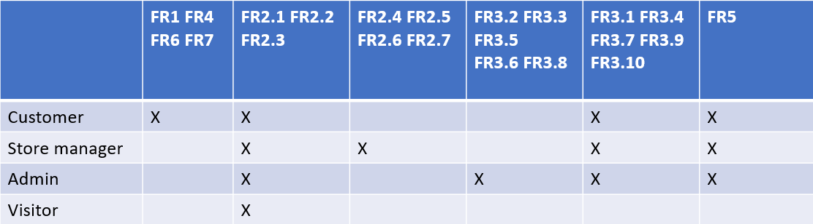
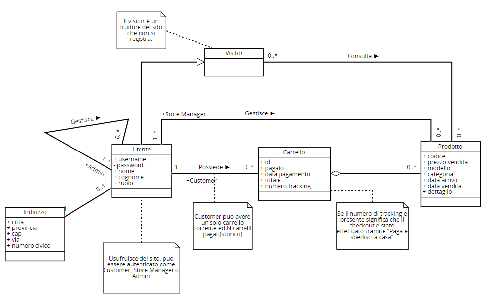
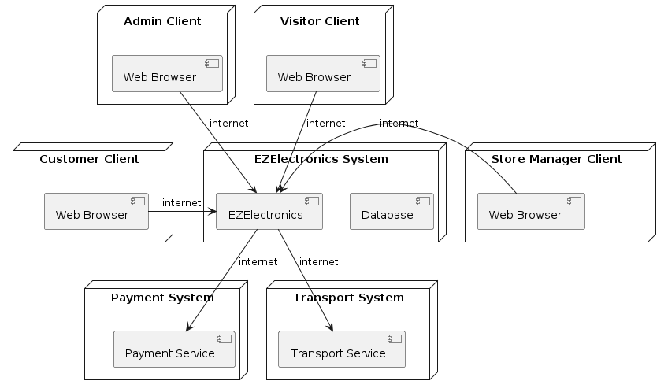

# Requirements Document - current EZElectronics

Date:

Version: V2 - description of EZElectronics in CURRENT form (as received by teachers)

| Version number | Change |
| :------------: | :----: |
|                |        |

# Contents

- [Requirements Document - current EZElectronics](#requirements-document---current-ezelectronics)
- [Contents](#contents)
- [Informal description](#informal-description)
- [Stakeholders](#stakeholders)
- [Context Diagram and interfaces](#context-diagram-and-interfaces)
  - [Context Diagram](#context-diagram)
  - [Interfaces](#interfaces)
- [Stories and personas](#stories-and-personas)
- [Functional and non functional requirements](#functional-and-non-functional-requirements)
  - [Functional Requirements](#functional-requirements)
  - [Table of rights](#table-of-rights)
  - [Non Functional Requirements](#non-functional-requirements)
- [Use case diagram and use cases](#use-case-diagram-and-use-cases)
  - [Use case diagram](#use-case-diagram)
    - [Use case 1, Aggiunta prodotto carrello](#use-case-1-aggiunta-prodotto-carrello)
        - [Scenario 1.1](#scenario-11)
        - [Scenario 1.2](#scenario-12)
        - [Scenario 1.3](#scenario-13)
    - [Use case 2, Rimozione prodotto Carrello](#use-case-2-rimozione-prodotto-carrello)
        - [Scenario 2.1](#scenario-21)
        - [Scenario 2.2](#scenario-22)
        - [Scenario 2.3](#scenario-23)
    - [Use case 3, Eliminazione Carrello](#use-case-3-eliminazione-carrello)
        - [Scenario 3.1](#scenario-31)
        - [Scenario 3.2](#scenario-32)
    - [Use case 4, Checkout Carrello](#use-case-4-checkout-carrello)
        - [Scenario 4.1](#scenario-41)
        - [Scenario 4.2](#scenario-42)
        - [Scenario 4.3](#scenario-43)
        - [Scenario 4.4](#scenario-44)
        - [Scenario 4.5](#scenario-45)
        - [Scenario 4.6](#scenario-46)
        - [Scenario 4.7](#scenario-47)
    - [Use case 5, Mostra carrello](#use-case-5-mostra-carrello)
      - [Scenario 5.1](#scenario-51)
    - [Use case 6, Registrazione arrivo prodotti](#use-case-6-registrazione-arrivo-prodotti)
        - [Scenario 6.1](#scenario-61)
        - [Scenario 6.2](#scenario-62)
    - [Use case 7, Eliminazione prodotto](#use-case-7-eliminazione-prodotto)
        - [Scenario 7.1](#scenario-71)
        - [Scenario 7.2](#scenario-72)
    - [Use case 8, Ricerca prodotti](#use-case-8-ricerca-prodotti)
        - [Scenario 8.1](#scenario-81)
        - [Scenario 8.2](#scenario-82)
    - [Use case 9, Filtra prodotti](#use-case-9-filtra-prodotti)
        - [Scenario 9.1](#scenario-91)
        - [Scenario 9.2](#scenario-92)
    - [Use case 10, Crea e registra nuovo prodotto](#use-case-10-crea-e-registra-nuovo-prodotto)
        - [Scenario 10.1](#scenario-101)
        - [Scenario 10.2](#scenario-102)
        - [Scenario 10.3](#scenario-103)
    - [Use case 11, Mostra prodotti](#use-case-11-mostra-prodotti)
        - [Scenario 11.1](#scenario-111)
        - [Scenario 11.2](#scenario-112)
    - [Use case 12, Creazione Account utente](#use-case-12-creazione-account-utente)
        - [Scenario 12.1](#scenario-121)
        - [Scenario 12.2](#scenario-122)
    - [Use case 13, Login](#use-case-13-login)
        - [Scenario 13.1](#scenario-131)
        - [Scenario 13.2](#scenario-132)
    - [Use case 14, Logout](#use-case-14-logout)
        - [Scenario 14.1](#scenario-141)
    - [Use case 15, Eliminazione utente](#use-case-15-eliminazione-utente)
        - [Scenario 15.1](#scenario-151)
        - [Scenario 15.2](#scenario-152)
    - [Use case 16, Filtra utenti](#use-case-16-filtra-utenti)
        - [Scenario 16.1](#scenario-161)
        - [Scenario 16.2](#scenario-162)
        - [Scenario 16.3](#scenario-163)
    - [Use case 17, Mostra utenti](#use-case-17-mostra-utenti)
        - [Scenario 17.1](#scenario-171)
    - [Use case 18, Mostra informazioni utente corrente](#use-case-18-mostra-informazioni-utente-corrente)
        - [Scenario 18.1](#scenario-181)
    - [Use case 19, Storico carrelli](#use-case-19-storico-carrelli)
        - [Scenario 19.1](#scenario-191)
        - [Scenario 19.2](#scenario-192)
    - [Use case 20, Modifica ruolo utente](#use-case-20-modifica-ruolo-utente)
        - [Scenario 20.1](#scenario-201)
        - [Scenario 20.2](#scenario-202)
    - [Use case 21, Modifica indirizzo](#use-case-21-modifica-indirizzo)
        - [Scenario 21.1](#scenario-211)
        - [Scenario 21.2](#scenario-212)
    - [Use case 22, Conferma vendita prodotto/i](#use-case-22-conferma-vendita-prodottoi)
        - [Scenario 22.1](#scenario-221)
        - [Scenario 22.2](#scenario-222)
        - [Scenario 22.3](#scenario-223)
        - [Scenario 22.4](#scenario-224)
- [Glossary](#glossary)
- [System Design](#system-design)
- [Deployment Diagram](#deployment-diagram)

# Informal description

EZElctronics è un'applicazione software pensata per aiutare i manager di negozi di elettronica a gestire i loro prodotti e venderli attraverso un sito web dedicato. I manager possono inserire nuovi prodotti, registrarne l'arrivo e confermare la vendita dei prodotti acquistati in negozio. I visitatori non autenticati possono solamente navigare la lista dei prodotti disponibili. I customer in aggiunta possono aggiungere i prodotti al loro carrello, vedere lo storico dei carrelli acquistati e acquistare i prodotti o direttamente online o con ritiro e pagamento in negozio. Gli admin invece si occupano della gestione degli utenti e dei rispettivi profili.

# Stakeholders

| Stakeholder name | Description |
| :--------------: | :---------: |
| Customer  |  Utente che acquista i prodotti     |
| Store Manager  | Utente che gestisce l'inventario e conferma gli ordini           |
| Payment service  | Utilizzato per gestire le transazioni            |
| Admin  |  Utente che gestisce gli altri utenti       |
| Visitor| Fruitore del sito che non si registra |

# Context Diagram and interfaces

## Context Diagram

## Interfaces

|   Actor   | Logical Interface | Physical Interface |
| :-------: | :---------------: | :----------------: |
| Customer  |      GUI          |     PC /  Smartphone|
| Store Manager | GUI | PC / Smartphone|
|Admin    | GUI                 | PC / smartphone|
| Payment Service | https://developer.paypal.com/docs/payouts/standard/integrate-api/ | Internet |
| Transport Service | https://www.sda.it/wps/portal/sdait.home/Soluzioni_digitali/Integrazioni_di_sistema/WEBSERVICES?locale=it | Internet |
| Visitor | GUI | PC/smartphone |

# Stories and personas

Marco è un ragazzo di 25 anni che vuole comprare componenti per assemblare un pc. Nella ricerca per pezzi a prezzi convenienti, ha scoperto il sito EZElectronics grazie a un suo collega. Marco ha eseguito la procedura di registrazione come cliente e, dopo aver fatto accesso al sito e aver navigato per circa un' ora, trova e acquista i componenti necessari, da ritirare in negozio.

Emma è una donna 30 anni che lavora come manager per lo store online di EZElectronics. Nella sua giornata gestisce il sito, ad esempio aggiungendo i prodotti non appena arrivano e confermare le vendite.

Luca è un ragazzo di 23 anni parte integrante del team dello store online EZElectronics. Il suo ruolo consiste nell'amministrare gli account degli utenti (creazione, cambio di ruolo, eliminazione).

# Functional and non functional requirements

## Functional Requirements

|  ID   | Description |
| :---: | :---------: |
| FR1 | Gestione carrello |
| FR1.1 | Aggiungi prodotto| 
| FR1.2 | Elimina carrello corrente | 
| FR1.3 | Checkout carrello | 
| FR1.4 | Mostra carrello | 
| FR1.5 | Rimuovi prodotto| 
| FR2 | Gestione prodotti| 
| FR2.1 | Ricerca prodotto| 
| FR2.2 | Filtra prodotti (category, model, sold)| 
| FR2.3 | Mostra prodotti | 
| FR2.4 | Crea prodotto | 
| FR2.5 | Conferma vendita/e prodotto/i | 
| FR2.6 | Eliminazione prodotto | 
| FR2.7 | Registra arrivo prodotti dello stesso modello| 
| FR3| Gestione Account |
| FR3.1| Creazione utente| 
| FR3.2| Eliminazione utente| 
| FR3.3| Cambio ruolo utente| 
| FR3.4| Login utenti| 
| FR3.5| Filtra utenti| 
| FR3.6| Mostra lista utenti| 
| FR3.7| Mostra utente loggato| 
| FR3.8| Ricerca utente| 
| FR3.9| Logout utente| 
| FR3.10 | Modifica indirizzo utente |
| FR4| Gestione ordini |
| FR4.1| Mostra storico carrelli pagati| 
| FR5| Gestione privacy|
| FR5.1 | Mostra termini di servizio|
| FR6 | Gestione dei pagamenti |
| FR6.1| Richiesta di pagamento |
| FR6.2| Gestione dati di pagamento|
| FR7 | Gestione spedizione |
| FR7.1| Richiesta di spedizione |
| FR7.2| Gestione dati di spedizione |

## Table of rights

## Non Functional Requirements

|   ID    | Type (efficiency, reliability, ..) | Description | Refers to |
| :-----: | :--------------------------------: | :---------: | :-------: |
|  NFR1 | Usabilità | Utenti non hanno bisogno di training | FR3 |
| NFR2 | Usabilità | La sessione deve essere mantenuta attiva almeno 12 ore |    FR3       |
| NFR3 |   Portabilità | Chrome: 97.0.4692.99, Firefox:  96.0.1, Safari: 15.1|      FR1,FR2,FR3,FR4     |
| NFR4 |  Portabilità | Il sito deve essere responsive per schermi che vanno da 360x720 pixels a 3840x2160 pixels |    FR1,FR2,FR3,FR4       |
| NFR5 | Sicurezza | Le password devono essere salvate sul database con un algoritmo di hashing salted|   FR3        | 
| NFR6|Sicurezza|GDPR privacy policy requirements| FR5 |
|  NFR7 | Efficienza | Tempo di risposta del server inferiore a 0.2s |      FR1,FR2,FR3,FR4     |
|  NFR8 | Affidabilità | Sito non deve essere offline per più di 7gg all'anno|      FR1,FR2,FR3,FR4,FR5     |
| NFR9 |   Correttezza | Test Coverage >= 80%  |     FR1,FR2,FR3,FR4,FR5,FR6      |
| NFR10 | Manutenibilità | 8 ore/persona necessarie per sistemare un malfunzionamento |      FR1,FR2,FR3,FR4,FR5,FR6     |
| NFR11 | Manutenibilità | 20 ore/persona necessarie per tempistiche di deploy per una nuova versione|     FR1,FR2,FR3,FR4,FR5,FR6      |

# Use case diagram and use cases

Per gli use case: mostra utenti, eliminazione utente e filtra utenti si è seguito alla lettera il documento di riferimento delle API, pertanto si è permesso l'accesso alle suddette funzionalità senza requisiti di login specifici, anche se sarebbe opportuno considerarne l'utilizzo solo per utenti autenticati come store manager.

## Use case diagram

### Use case 1, Aggiunta prodotto carrello

| Actors Involved  |        Customer                                                             |
| :--------------: | :------------------------------------------------------------------: |
|   Precondition   | Utente loggato come Customer |
|  Post condition  | prodotto aggiunto al carrello |
| Nominal Scenario |       Scenario 1.1 ( utente aggiunge un elemento al carrello)         |
|     Variants     |    -           |
|    Exceptions    | Scenario 1.2(il prodotto non esiste ,Error 404), Scenario 1.3 ( il prodotto non è disponibile (venduto o in un altro carrello) (Error 409))                       |

##### Scenario 1.1

|  Scenario 1.1  |                                                                            |
| :------------: | :------------------------------------------------------------------------: |
|  Precondition  | Utente autenticato come Customer |
| Post condition |  Aggiunta elemento al carrello|
|     Step#      |                                Description                                 |
|       1        |      Il sito mostra la lista dei prodotti                                                                   |
|       2        |        L'utente inserisce un prodotto nel carrello                                                                    |
|      3       |            Il sistema aggiorna il carrello                                                        |

##### Scenario 1.2

|  Scenario 1.2  |                                                                            |
| :------------: | :------------------------------------------------------------------------: |
|  Precondition  | Utente autenticato come Customer |
| Post condition |  Lancio errore 404|
|     Step#      |                                Description                                 |
|       1      |      Il sito mostra la lista dei prodotti                                                                   |
|       2      |        L'utente inserisce un prodotto nel carrello                   |
|      3       |            Il sistema ritorna un messaggio 404 perchè il prodotto non esiste  |

##### Scenario 1.3

|  Scenario 1.3  |                                                                            |
| :------------: | :------------------------------------------------------------------------: |
|  Precondition  | Utente autenticato come Customer |
| Post condition |  Lancio errore 409 |
|     Step#      |                                Description                                 |
|       1        |      Il sito mostra la lista dei prodotti                                                                   |
|       2        |        L'utente inserisce un prodotto nel carrello                                                                    |
|      3       |            Il sistema ritorna un messaggio 409 perchè il prodotto non è disponibile (venduto o in un altro carrello)   |

### Use case 2, Rimozione prodotto Carrello

| Actors Involved  |         Customer                                                             |
| :--------------: | :------------------------------------------------------------------: |
|   Precondition   | Utente loggato come Customer, carrello con un elemento |
|  Post condition  |  Elemento rimosso dal carrello |
| Nominal Scenario |        Scenario 2.1 (Rimozione di un elemento dal carrello)         |
|     Variants     |     -        |
|    Exceptions    |   Scenario 2.2  (codice prodotto non presente nel carrello (ERROr 404),carrello non esistente (ERROR 404)), Scenario 2.3(codice prodotto insesistente (ERROR 409), codice prodotto di un prodotto già venduto (ERROR 409))                       |

##### Scenario 2.1

|  Scenario 2.1  |                                                                            |
| :------------: | :------------------------------------------------------------------------: |
|  Precondition  | Carrello con almeno un elemento, Utente autenticato come Customer |
| Post condition |  Rimozione elemento dal carrello|
|     Step#      |                                Description                                 |
|       1        |      L'utente   apre il carrello                                                           |
|       2        |      Il sistema mostra il carrello                                         |
|       3        |        L'utente chiede di rimuovere un prodotto                                                                    |
|      4       |            Il sistema aggiorna il carrello                                                         |

##### Scenario 2.2

|  Scenario 2.2  |                                                                            |
| :------------: | :------------------------------------------------------------------------: |
|  Precondition  | Utente autenticato come Customer |
| Post condition |  Lancio Errore 404 |
|     Step#      |                                Description                                 |
|       1        |      L'utente   apre il carrello                                                           |
|       2        |      Il sistema mostra il carrello                                         |
|       3        |        L'utente chiede di rimuovere un prodotto                                                                    |
|      4       |            Il sistema lancia l'errore 404 (prodotto non nel carrello, prodotto e/o carrello non esistente)           |

##### Scenario 2.3

|  Scenario 2.3  |                                                                            |
| :------------: | :------------------------------------------------------------------------: |
|  Precondition  | Carrello con almeno un elemento, Utente autenticato come Customer |
| Post condition |  Lancio Errore 409|
|     Step#      |                                Description                                 |
|       1        |      L'utente   apre il carrello                                                           |
|       2        |      Il sistema chiede di rimuovere un prodotto                                        |
|       3        |        L'utente rimuove un elemento                                                                    |
|      4       |            Il sistema lancia l'errore 409 (prodotto già venduto)                                                         |

### Use case 3, Eliminazione Carrello

| Actors Involved  |         Customer                                                             |
| :--------------: | :------------------------------------------------------------------: |
|   Precondition   | Utente autenticato come Customer   |
|  Post condition  |  Carrello eliminato|
| Nominal Scenario |  Scenario 3.1 (Utente richiede di eliminare il carello corrente)         |
|     Variants     |        -|
|    Exceptions    |                Scenario 3.2  (Carrello non esistente (Error 404))|

##### Scenario 3.1

|  Scenario 3.1  |                                                                            |
| :------------: | :------------------------------------------------------------------------: |
|  Precondition  | Utente possiede un carrello, Utente autenticato come Customer|
| Post condition |  Carrello eliminato |
|     Step#      |                                Description                                 |
|       1        |      L'utente   apre il carrello                                                           |
|       2        |      Il sistema mostra il carrello                                         |
|       3        |        L'utente richiede eliminazione del carrello                                                               |
|      4       |            Il sistema elimina il carrello                                                         |

##### Scenario 3.2

|  Scenario 3.2  |                                                                            |
| :------------: | :------------------------------------------------------------------------: |
|  Precondition  | Utente autenticato come Customer|
| Post condition | Errore 404 |
|     Step#      |                                Description                                 |
|       1        |      L'utente   apre il carrello                                                           |
|       2        |      Il sistema mostra il carrello                                         |
|       3        |        L'utente richiede eliminazione del carrello                                                               |
|      4       |            Il sistema lancia l'errore 404                                                        |

### Use case 4, Checkout Carrello
| Actors Involved  |         Customer               |
| :--------------: | :------------------------------------------------------------------: |
|   Precondition   | Utente autenticato come Customer|
|  Post condition  |  Checkout effettuato   |
| Nominal Scenario | Scenario 4.1 (Utente fa il checkout online del carrello)         |
|     Variants     |   Scenario 4.6 (Utente fa checkout carrello ma con ritiro in negozio)   |
|    Exceptions    |  Scenario 4.2 (Il carrello non esiste(Error 404)), Scenario 4.3(carrello vuoto (ERROR 404)), Scenario 4.4 (almeno uno dei codici prodotto non esiste (ERROR 404)), Scenario 4.5 (il prodotto è gia stato venduto), 4.7 (checkout con metodo:"paga e spedisci a casa" effettuato senza un indirizzo associato all'utente)  |

##### Scenario 4.1

|  Scenario 4.1  |     |
| :------------: | :------------------------------------------------------------------------: |
|  Precondition  | Carrello con almeno un elemento, Utente autenticato come Customer, indirizzo specificato|
| Post condition |  Checkout effettuato con successo|
|     Step#      |    Description     |
|       1        |      L'utente apre il carrello          |
|       2        |      Il sistema mostra il carrello          |
|       3        |    L'utente richiede checkout del carrello e seleziona il metodo di pagamento: "paga e spedisci a casa"  |
| 4 | EZElectronics verifica disponibilità dei prodotti richiesti, controlla presenza di un indirizzo dell'utente e in caso di esito positivo invia reindirizza l'utente verso la pagina di pagamento|
|5| L'utente inserisce dati di pagamento e conferma |
|6| EZElectronics ingaggia servizio di trasporto che genera il numero di tracking, aggiorna stato carrello e mostra conferma |

##### Scenario 4.2

|  Scenario 4.2  |               |
| :------------: | :------------------------------------------------------------------------: |
|  Precondition  | Carrello vuoto, Utente autenticato come Customer|
| Post condition |  Checkout non riuscito|
|     Step#      |                                Description                                 |
|       1        |      L'utente apre il carrello    |
|       2        |      Il sistema mostra il carrello       |
|       3        |        L'utente richiede checkout del carrello       |
|      4       |            Il sistema lancia l'errore 404 perchè il carrello è vuoto      |

##### Scenario 4.3

|  Scenario 4.3  |                 |
| :------------: | :------------------------------------------------------------------------: |
|  Precondition  | Carrello con almeno un elemento, Utente autenticato come Customer|
| Post condition |  Checkout effettuato con successo|
|     Step#      |                                Description     |
|       1        |      L'utente apre il carrello      |
|       2        |      Il sistema mostra il carrello  |
|       3        |        L'utente richiede checkout del carrello     |
|      4     |  Il sistema lancia l'errore 404 (carrello insesistente)   |

##### Scenario 4.4

|  Scenario 4.4  |                 |
| :------------: | :------------------------------------------------------------------------: |
|  Precondition  | Carrello con almeno un elemento, Utente autenticato come Customer|
| Post condition |  Checkout effettuato con successo|
|     Step#      |         Description     |
|       1        |      L'utente apre il carrello     |
|       2        |      Il sistema mostra il carrello    |
|       3  | L'utente richiede checkout del carrello         |
|      4       |  EZElectronics verifica disponibilità dei prodotti richiesti e lancia l'errore 404 (almeno uno dei codici prodotto non esiste)    |

##### Scenario 4.5

|  Scenario 4.5  |                 |
| :------------: | :------------------------------------------------------------------------: |
|  Precondition  | Carrello con almeno un elemento, Utente autenticato come Customer|
| Post condition |  Checkout effettuato con successo|
|     Step#      |         Description     |
|       1        |      L'utente apre il carrello     |
|       2        |      Il sistema mostra il carrello    |
|       3  | L'utente richiede checkout del carrello         |
|      4       |  EZElectronics verifica disponibilità dei prodotti richiesti e lancia l'errore (il prodotto è già stato venduto)    |

##### Scenario 4.6

|  Scenario 4.6  |                 |
| :------------: | :---------: |
|  Precondition  | Carrello con almeno un elemento, Utente autenticato come Customer|
| Post condition |  Checkout effettuato con successo|
|     Step#      |    Description     |
|       1        |      L'utente apre il carrello          |
|       2        |      Il sistema mostra il carrello          |
|       3        |    L'utente richiede checkout del carrello con metodo di pagamento:"ritiro e pagamento in negozio"  |
| 4 | EZElectronics effettua il checkout| 

##### Scenario 4.7

|  Scenario 4.7  |                 |
| :------------: | :---------: |
|  Precondition  | Carrello con almeno un elemento, Utente autenticato come Customer|
| Post condition |  Checkout effettuato con successo|
|     Step#      |    Description     |
|       1        |      L'utente apre il carrello          |
|       2        |      Il sistema mostra il carrello          |
|       3        |    L'utente richiede checkout del carrello con metodo di pagamento:"paga e spedisci a casa"  |
| 4 | EZElectronics rileva mancanza di un indirizzo associato all'account e mostra errore| 

### Use case 5, Mostra carrello

| Actors Involved  |         Customer                                                            |
| :--------------: | :------------------------------------------------------------------: |
|   Precondition   | Utente loggato come customer|
|  Post condition  | carrello dal sistema |
| Nominal Scenario | Scenario 5.1 (Sitstema mostra carrello dell'utente corrente)          |
|     Variants     |        -          |
|    Exceptions    |               |

#### Scenario 5.1

|  Scenario 5.1  |                                                                            |
| :------------: | :------------------------------------------------------------------------: |
|  Precondition  | utente loggato come customer|
| Post condition | carrello mostrato dal sistema|
|    1   |       customer richiede di visualizzare il carrello |
|    2   |            Sistema mostra il carrello |

### Use case 6, Registrazione arrivo prodotti

| Actors Involved  |  Store Manager |
| :--------------: | :------------------------------------------------------------------: |
|   Precondition   | Utente autenticato come Store Manager |
|  Post condition  | Prodotti registrati all'interno del sistema |
| Nominal Scenario | Scenario 6.1 (Store manager registra più prodotti dello stesso modello)       |
|     Variants     | - |
|    Exceptions    | Scenario 6.2 (inserimento data di arrivo dopo quella corrente) |

##### Scenario 6.1

|  Scenario 6.1  |                                                                            |
| :------------: | :------------------------------------------------------------------------: |
|  Precondition  | utente loggato come store manager|
| Post condition |  Registrazione prodotti con molteplicitá > 1 |
|       1        |        Store manager chiede di registrare nuovi arrivi |
|      2       |            Sistema mostra form di inserimento data di arrivo |
|      3       |            Store manager inserisce data di arrivo |
|      4       |            Il sistema registra data di arrivo relativa ai prodotti interessati |

##### Scenario 6.2

|  Scenario 6.2  |                                                                            |
| :------------: | :------------------------------------------------------------------------: |
|  Precondition  | Store manager loggato|
| Post condition |  sistema mostra errore |
|       1       |        Store manager chiede di registrare nuovi arrivi |
|      2       |            Sistema mostra form di inserimento data di arrivo |
|      3       |            Store manager inserisce data/e di arrivo |
|      4       |            Il sistema mostra errore perchè la data di arrivo è dopo la data odierna |

### Use case 7, Eliminazione prodotto

| Actors Involved  |  Store Manager |
| :--------------: | :------------------------------------------------------------------: |
|   Precondition   | Utente autenticato come Store Manager |
|  Post condition  | Prodotto eliminato dal sistema |
| Nominal Scenario | Scenario 7.1 (Store manager elimina prodotto dal sistema)        |
|     Variants     | -  |
|    Exceptions    | Scenario 7.2 (Codice prodtto da eliminare non esistente (ERROR 404)) |

##### Scenario 7.1

|  Scenario 7.1  |                                                                            |
| :------------: | :------------------------------------------------------------------------: |
|  Precondition  | Store manager loggato|
| Post condition |  Prodotto eliminato |
|       1        |  Sistema mostra elenco prodotti |
|       2        |  Store manager seleziona 'elimina' accanto al prodotto che desidera eliminare |
|      3      |  Store manager conferma l'operazione |
|      4      |  Sistema elimina il prodotto dall'elenco |

##### Scenario 7.2

|  Scenario 7.2  |                                                                            |
| :------------: | :------------------------------------------------------------------------: |
|  Precondition  | Store manager loggato|
| Post condition |  Sistema mostra errore |
|       1        |  Sistema mostra elenco prodotti |
|       2        |  Store manager seleziona 'elimina' accanto al prodotto che desidera eliminare |
|      3       |  Sistema chiede conferma dell'operazione |
|      4       |  Store manager conferma l'operazione |
|      5       |  Sistema mostra errore 404  |

### Use case 8, Ricerca prodotti

| Actors Involved  |  Visitor, Customer, Store manager, Admin |
| :--------------: | :------------------------------------------------------------------: |
|   Precondition   | - |
|  Post condition  | Prodotto mostrato dal sistema |
| Nominal Scenario | Scenario 8.1(utente ricerca prodotto per codice)         |
|     Variants     | - |
|    Exceptions    | Scenario 8.2(Errore prodotto non trovato (error 404))|

##### Scenario 8.1

|  Scenario 8.1  |                                                                            |
| :------------: | :------------------------------------------------------------------------: |
|  Precondition  | -|
| Post condition |  Prodotto ricercato mostrato |
|       1        |  Sistema mostra elenco prodotti |
|       2        |  utente inserisce il codice prodotto nella barra di ricerca |
|      3       |  Sistema mostra prodotto ricercato |

##### Scenario 8.2
|  Scenario 8.2  |                                                                            |
| :------------: | :------------------------------------------------------------------------: |
|  Precondition  |- |
| Post condition |  Errore prodotto ricercato non trovato |
|       1        |  Sistema mostra elenco prodotti |
|       2        |  utente inserisce il codice prodotto nella barra di ricerca |
|      3       |  Sistema mostra messaggio di errore 404 |

### Use case 9, Filtra prodotti

| Actors Involved  |  Visitor, Customer, Admin, Store manager|
| :--------------: | :------------------------------------------------------------------: |
|   Precondition   |- |
|  Post condition  | Visualizzazione prodotti filtrati |
| Nominal Scenario | Scenario 9.1 (Utente filtra, per categoria o modello, lista di prodotti)       |
|     Variants     | Scenario 9.2 (utente applica ulteriore filtro per prodotti venduti/non venduti)    |
|    Exceptions    | - |

##### Scenario 9.1

|  Scenario 9.1  |                                                                            |
| :------------: | :------------------------------------------------------------------------: |
|  Precondition  |-|
| Post condition |  Visualizzazione lista prodotti filtrata |
|       1        |  utente seleziona filtro (categoria o modello) |
|      2       |  Sistema mostra lista prodotti filtrata secondo il filtro selezionato |

##### Scenario 9.2

|  Scenario 9.2  |                                                                            |
| :------------: | :------------------------------------------------------------------------: |
|  Precondition  |-|
| Post condition |  Visualizzazione lista prodotti filtrata |
|       1        |  utente seleziona filtro (categoria o modello) |
|      2       |  Sistema mostra lista prodotti filtrata secondo il filtro selezionato |
| 3 | utente seleziona filtro venduto/ non venduto|
| 4 | sistema mostra lista prodotti ulteriormente filtrati|

### Use case 10, Crea e registra nuovo prodotto
| Actors Involved  | Store Manager  |
| :--------------: | :---: |
|   Precondition   | utente loggato come manager|
|  Post condition  | nuovo prodotto aggiunto |
| Nominal Scenario | Scenario 10.1(Manager richiede di aggiungere prodotto ed EZElectronics lo aggiunge)|
|     Variants     | - |
|    Exceptions    | Scenario 10.2 (Inserimento prodotto duplicato (409)), Scenario 10.3 (inserimento data di arrivo dopo quella corrente) |

##### Scenario 10.1
|  Scenario 10.1  |   |
| :------------: | :---: |
|  Precondition  | utente loggato come manager|
| Post condition | nuovo prodotto aggiunto|
|     Step#      |Description |
|1| Manager chiede di aggiungere nuovo prodotto |
|2| EZElectronics mostra form per inserimento informazioni|
|3| Manager compila il form e invia i dati|
|4| EZElectronics valida i dati e inserisce nuovo prodotto|

##### Scenario 10.2
|  Scenario 10.2  |   |
| :------------: | :---: |
|  Precondition  | utente loggato come manager|
| Post condition | visualizzazione errore da parte del sistema|
|     Step#      |Description |
|1| Manager chiede di aggiungere nuovo prodotto |
|2| EZElectronics mostra form per inserimento informazioni|
|3| Manager compila il form e invia i dati|
|4| EZElectronics verifica i dati e torna errore 409 (prodotto gia esistente)|

##### Scenario 10.3
|  Scenario 10.3  |   |
| :------------: | :---: |
|  Precondition  | utente loggato come manager|
| Post condition | visualizzazione errore da parte del sistema|
|     Step#      |Description |
|1| Manager chiede di aggiungere nuovo prodotto |
|2| EZElectronics mostra form per inserimento informazioni|
|3| Manager compila il form e invia i dati|
|4| EZElectronics verifica i dati e torna errore (data di arrivo dopo la data odierna)|

### Use case 11, Mostra prodotti
| Actors Involved  | Visitor, Customer, Store Manager, Admin  |
| :--------------: | :---: |
|   Precondition   | - |
|  Post condition  | visualizzazione prodotti |
| Nominal Scenario | Scenario 11.1 (utente richiede di visualizzare tutti i prodotti e EZElectronics li mostra) |
|     Variants     | Scenario 11.2 (utente richiede di visualizzare prodotti per venduto/non venduto) |
|    Exceptions    | - |

##### Scenario 11.1
|  Scenario 11.1  |   |
| :------------: | :---: |
|  Precondition  | - |
| Post condition | prodotti visualizzati|
|     Step#      |Description |
|1| utente chiede di visualizzare tutti i prodotti |
|2| EZElectronics mostra i prodotti|

##### Scenario 11.2
|  Scenario 11.2  |   |
| :------------: | :---: |
|  Precondition  | - |
| Post condition | prodotti filtrati e visualizzati|
|     Step#      |Description |
|1| utente chiede di visualizzare i prodotti venduti/non venduti |
|2| EZElectronics mostra i prodotti filtrati richiesti|

### Use case 12, Creazione Account utente
| Actors Involved  |  Admin, Customer, Store Manager |
| :--------------: | :---: |
|   Precondition   | Utente non registrato |
|  Post condition  | Utente Registrato |
| Nominal Scenario | Scenario 12.1 (Utente visita EZElectronics e si registra inserendo i dati personali)|
|     Variants     | - |
|    Exceptions    | Scenario 12.2 (l'utente inserisce uno username duplicato(ERROR 409)) |

##### Scenario 12.1
|  Scenario 12.1  |   |
| :------------: | :---: |
|  Precondition  | Utente non registrato|
| Post condition | Utente registrato|
|     Step#      |Description |
|1| Utente chiede di effettuare registrazione |
|2| EZElectronics mostra form registrazione|
|3| Utente inserisce dati personali e accetta termini di servizio|
|4| Sistema valida, salva i dati e crea nuovo account| 

##### Scenario 12.2
|  Scenario 12.2  |   |
| :------------: | :---: |
|  Precondition  | Utente non registrato|
| Post condition | Sistema mostra errore|
|     Step#      |Description |
|1| Utente chiede di effettuare registrazione |
|2| EZElectronics chiede dati personali|
|3| Utente inserisce dati personali e accetta termini di servizio|
|4| Sistema individua username duplicato e torna errore 409|

### Use case 13, Login
| Actors Involved  | Store Manager, Customer, Admin |
| :--------------: | :---: |
|   Precondition   | Utente non loggato |
|  Post condition  | Utente loggato |
| Nominal Scenario | Scenario 13.1 (Utente visita EZElectronics e accede al proprio account)|
|     Variants     | - |
|    Exceptions    | Scenario 13.2 (l'utente inserisce dei dati non validi)|

##### Scenario 13.1
|  Scenario 13.1  |   |
| :------------: | :---: |
|  Precondition  | Utente non loggato|
| Post condition | Utente loggato|
|     Step#      |Description |
|1| Utente visita EZElectronics|
|2| EZElectronics visualizza pagina principale|
|3| Utente chiede di effettuare login |
|4| EZElectronics chiede dati di accesso|
|5| Utente inserisce dati di accesso|
|6| Sistema valida i dati e avvia sessione|

##### Scenario 13.2
|  Scenario 13.2  |   |
| :------------: | :---: |
|  Precondition  | Utente non loggato|
| Post condition | - |
|     Step#      |Description |
|1| Utente visita EZElectronics|
|2| EZElectronics visualizza pagina principale|
|3| Utente chiede di effettuare login |
|4| EZElectronics chiede dati di accesso|
|5| Utente inserisce dati di accesso|
|6| Sistema rileva errore nei dati e torna errore|

### Use case 14, Logout
| Actors Involved  | Customer, Store Manager, Admin  |
| :--------------: | :---: |
|   Precondition   | Utente loggato |
|  Post condition  | Utente non loggato |
| Nominal Scenario | Scenario 14.1 (Utente si disconnette dal proprio account EZElectronics)|
|     Variants     | - |
|    Exceptions    | -|

##### Scenario 14.1
|  Scenario 14.1  |   |
| :------------: | :---: |
|  Precondition  | Utente loggato|
| Post condition | Utente non loggato|
|     Step#      |Description |
|1| Utente chiede di effettuare logout |
|2| EZElectronics termina la sessione dell'account|

### Use case 15, Eliminazione utente
| Actors Involved  | Admin  |
| :--------------: | :---: |
|   Precondition   | Utente autenticato come Admin |
|  Post condition  | utente desiderato eliminato |
| Nominal Scenario | Scenario 15.1 (Utente elimina un utente EZElectronics)|
|     Variants     | -|
|    Exceptions    | Scenario 15.2 (tentativo di eliminare un utente non esistente (ERROR 404))|

##### Scenario 15.1
|  Scenario 15.1  |   |
| :------------: | :---: |
|  Precondition  | Utente autenticato come Admin |
| Post condition | utente desiderato eliminato|
|     Step#      |Description |
|1| Utente chiede di eliminare uno specifico utente |
|2| EZElectronics elimina utente e relativi dati|

##### Scenario 15.2
|  Scenario 15.2  |   |
| :------------: | :---: |
|  Precondition  |Utente autenticato come Admin|
| Post condition |Sistema visualizza errore|
|     Step#      |Description |
|1| Utente chiede di eliminare l'account |
|2| EZElectronics torna errore perchè l'account selezionato non esiste|

### Use case 16, Filtra utenti
| Actors Involved  | Admin  |
| :--------------: | :---: |
|   Precondition   | Utente autenticato come Admin |
|  Post condition  | Visulalizzazione utenti filtrati|
| Nominal Scenario | Scenario 16.1 (Utente filtra utenti per username)|
|     Variants     | Scenario 16.2 (Utente filtra utenti per ruolo) |
|    Exceptions    | Scenario 16.3 (Username cercato non esiste( ERROR 404))|

##### Scenario 16.1
|  Scenario 16.1  |   |
| :------------: | :---: |
|  Precondition  |Utente autenticato come Admin|
| Post condition | Visulalizzazione utenti filtrati|
|     Step#      |Description |
|1| Utente chiede di visualizzare utenti |
|2| EZElectronics mostra utenti|
|3| Utente chiede di filtrare utenti per username|
|4| EZElectronics richiede username|
|5| Utente inserisce username|
|6| EZElectronics visualizza utente cercato|

##### Scenario 16.2
|  Scenario 16.2  |   |
| :------------: | :---: |
|  Precondition  |Utente autenticato come Admin|
| Post condition | Sistema visulalizza errore 404|
|     Step#      |Description |
|1| Utente chiede di visualizzare utenti |
|2| EZElectronics mostra utenti|
|3| Utente chiede di filtrare utenti per username|
|4| EZElectronics richiede username|
|5| Utente inserisce username|
|6| EZElectronics torna errore visto che lo username cercato non esiste|

##### Scenario 16.3
|  Scenario 16.3  |   |
| :------------: | :---: |
|  Precondition  | Utente autenticato come Admin|
| Post condition | Visulalizzazione utenti filtrati|
|     Step#      |Description |
|1| Utente chiede di visualizzare utenti |
|2| EZElectronics mostra utenti|
|3| Utente chiede di filtrare utenti per ruolo|
|4| EZElectronics richiede di selezionare un ruolo per cui filtrare|
|5| Utente sleziona ruolo|
|6| EZElectronics visualizza utenti filtrati|

### Use case 17, Mostra utenti
| Actors Involved  | Admin |
| :--------------: | :---: |
|   Precondition   |Utente autenticato come Admin|
|  Post condition  | Sistema mostra utenti |
| Nominal Scenario | Scenario 17.1 (Dopo richiesta da parte dell'utente EZElectronics mostra lista degli utenti)|
|     Variants     | - |
|    Exceptions    | -|

##### Scenario 17.1
|  Scenario 17.1  |   |
| :------------: | :---: |
|  Precondition  | Utente autenticato come Admin|
| Post condition |Sistema mostra utenti|
|     Step#      |Description |
|1| Utente chiede di visualizzare utenti |
|2| EZElectronics mostra utenti|

### Use case 18, Mostra informazioni utente corrente
| Actors Involved  | Customer, Store Manager, Admin |
| :--------------: | :---: |
|   Precondition   | utente loggato|
|  Post condition  | informazioni visualizzate |
| Nominal Scenario | Scenario 18.1 (Dopo richiesta da parte dell'utente EZElectronics mostra informazione relative all'utente)|
|     Variants     | - |
|    Exceptions    | -|

##### Scenario 18.1
|  Scenario 18.1  |   |
| :------------: | :---: |
|  Precondition  | utente loggato|
| Post condition |informazioni visualizzate|
|     Step#      |Description |
|1| Utente chiede di visualizzare le proprie informazioni |
|2| EZElectronics mostra le informazioni relative all'utente|

### Use case 19, Storico carrelli
| Actors Involved  |  Customer |
| :--------------: | :---: |
|   Precondition   | Utente autenticato come customer |
|  Post condition  | Storico carrelli utente visualizzato|
| Nominal Scenario | Scenario 19.1 (L'utente visualizza il proprio storico carrelli)
 |
|     Variants     | - |
|    Exceptions    | Scenario 19.2 (carrelli non trovati)|

##### Scenario 19.1
|  Scenario 19.1  |   |
| :------------: | :---: |
|  Precondition  | Utente autenticato come customer|
| Post condition | Utente visualizza lista carrelli|
|     Step#      |Description |
|1| Utente apre la sezione "storico carrelli"|
|2| Il sistema cerca i carrelli associati all'utente|
|3| La lista dei carrelli effettuati viene restituita all'utente|

##### Scenario 19.2
|  Scenario 19.2  |   |
| :------------: | :---: |
|  Precondition  | Utente autenticato come customer|
| Post condition | Lancio errore "Nessun ordine eseguito"|
|     Step#      |Description |
|1| Utente apre la sezione "storico carrelli"|
|2| Il sistema cerca i carrelli associati all'utente|
|3| Il sistema restituisce un messaggio di errore "Impossibile visualizzare ordini, nessun ordine eseguito"|

### Use case 20, Modifica ruolo utente
| Actors Involved  |  Admin |
| :--------------: | :---: |
|   Precondition   | Utente autenticato come admin |
|  Post condition  | Il ruolo di uno specifico utente è stato modificato|
| Nominal Scenario | Scenario 20.1 (admin accede al profilo di un determinato utente e ne cambia il ruolo) |
|     Variants     | - |
|    Exceptions    | Scenario 20.2 (tentativo di eliminare un utente non esistente (ERROR 404)) |

##### Scenario 20.1
|  Scenario 20.1  |   |
| :------------: | :---: |
|  Precondition  | Utente autenticato come admin|
| Post condition |Il ruolo di uno specifico utente è stato modificato|
|     Step#      |Description |
|1| Admin richiede di modificare il ruolo di un utente|
|2| EZElectronics mostra possibili scelte del ruolo|
|3| Admin seleziona il nuovo ruolo da assegnare e conferma scelta|
|2| EZElectronics salva il nuovo ruolo asegnato all'utente|

##### Scenario 20.2
|  Scenario 20.2  |   |
| :------------: | :---: |
|  Precondition  | Utente autenticato come admin|
| Post condition |Sistema mostra errore 404|
|     Step#      |Description |
|1| Admin richiede di modificare il ruolo di un utente|
|2| EZElectronics mostra errore 404 (utente richiesto non esistente)|

### Use case 21, Modifica indirizzo
| Actors Involved  |  Customer, Store Manager, Admin |
| :--------------: | :---: |
|   Precondition   | Utente loggato |
|  Post condition  | l'indirizzo dell'utente è stato modificato|
| Nominal Scenario | Scenario 21.1 (utente accede al profilo e cambia il proprio indirizzo) |
|     Variants     | - |
|    Exceptions    | Scenario 21.2 (tentativo di modificare indirizzo di un utente non esistente (ERROR 404)) |

##### Scenario 21.1
|  Scenario 21.1  |   |
| :------------: | :---: |
|  Precondition  | Utente loggato|
| Post condition |Il ruolo di uno specifico utente è stato modificato|
|     Step#      |Description |
|1| Utente richiede di modificare il proprio indirizzo|
|2| EZElectronics mostra form di inserimento|
|3| Utente inserisce nuovo indirizzo|
|2| EZElectronics aggiorna l'indirizzo|

##### Scenario 21.2
|  Scenario 21.2  |   |
| :------------: | :---: |
|  Precondition  | Utente loggato|
| Post condition |Sistema mostra errore 404|
|     Step#      |Description |
|1| utente richiede di modificare il proprio indirizzo|
|2| EZElectronics mostra errore 404 (utente non esistente)|

### Use case 22, Conferma vendita prodotto/i

| Actors Involved  |  Store Manager |
| :--------------: | :------------------------------------------------------------------: |
|   Precondition   | Utente autenticato come Store Manager |
|  Post condition  | Prodotto segnato come venduto |
| Nominal Scenario | Scenario 22.1     |
|     Variants     | Scenario 22.4   |
|    Exceptions    | Scenario 22.2, Scenario 22.3|

##### Scenario 22.1

|  Scenario 22.1  |                                                                            |
| :------------: | :------------------------------------------------------------------------: |
|  Precondition  | Store manager loggato|
| Post condition |  Vendita prodotto confermata |
|1| Store manager preme su pulsante conferma vendite|
|2| EZElectronics mostra lista dei prodotti di cui è stato fatto il checkout tramite metodo di pagamento: "ritiro e pagamento in negozio"|
| 3|  Store manager chiede di segnare un prodotto come venduto (opzionalmente specificando data di vendita) |
| 4 |  Sistema aggiorna lo stato del prodotto |

##### Scenario 22.2

|  Scenario 22.2 |                                                                            |
| :------------: | :------------------------------------------------------------------------: |
|  Precondition  | Store manager loggato|
| Post condition |  sistema mostra errore (404) |
|1| Store manager preme su pulsante conferma vendite|
|2| EZElectronics mostra lista dei prodotti di cui è stato fatto il checkout tramite metodo di pagamento: "ritiro e pagamento in negozio"|
|       3        |  Store manager chiede di segnare un prodotto come venduto (opzionalmente specificando data di vendita) |
|      4      |  Sistema mostra errore(404) |

##### Scenario 22.3

|  Scenario 22.3 |                                                                            |
| :------------: | :------------------------------------------------------------------------: |
|  Precondition  | Store manager loggato|
| Post condition |  sistema mostra errore |
|1| Store manager preme su pulsante conferma vendite|
|2| EZElectronics mostra lista dei prodotti di cui è stato fatto il checkout tramite metodo di pagamento: "ritiro e pagamento in negozio"|
|       3       |  Store manager chiede di segnare un prodotto come venduto (opzionalmente specificando data di vendita) |
|      4     |  Sistema mostra errore (data di vendita antecedente quella di arrivo, data di vendita dopo quella corrente, il prodotto è gia stato venduto) |

##### Scenario 22.4

|  Scenario 22.4 |                                                                            |
| :------------: | :------------------------------------------------------------------------: |
|  Precondition  | Store manager loggato|
| Post condition |  Vendita prodotto confermata |
|1| Store manager preme su pulsante conferma vendite|
|2| EZElectronics mostra lista dei prodotti di cui è stato fatto il checkout tramite metodo di pagamento: "ritiro e pagamento in negozio"|
|       3       |  Store manager chiede di segnare come venduti tutti i prodotti visualizzati |
|      4     |  EZElectronics aggiorna lo stato dei prodotti |

# Glossary

# System Design

# Deployment Diagram

