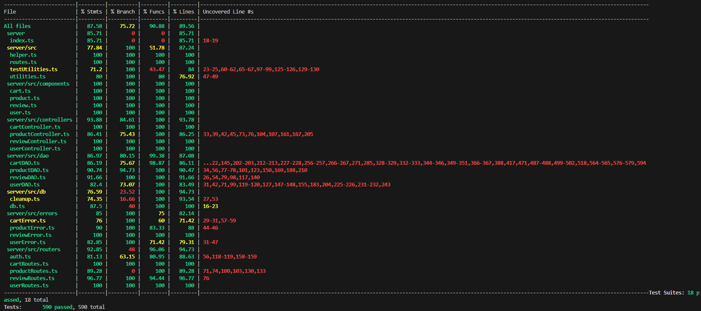

# Test Report

# Contents

- [Test Report](#test-report)
- [Contents](#contents)
- [Dependency graph](#dependency-graph)
- [Integration approach](#integration-approach)
- [Tests](#tests)
- [Coverage](#coverage)
  - [Coverage of FR](#coverage-of-fr)
  - [Coverage white box](#coverage-white-box)

# Dependency graph

# Integration approach

**Approach:** bottom-up\
**Step1:** Test integration between DAO and database\
**Step2:** Test integration between controller, DAO and database\
**Step3:** Test integration between route, controller, DAO and database

# Tests

| Test case name | Object(s) tested | Test level | Technique used |
| :------------: | :--------------: | :--------: | :------------: |
|        UUR 1, UUR 2,UUR 3, UUR 4, UUR 5, UUR 6, UUR 7, UUR 8, UUR 9, UUR 10     |  User, Routes    | Unit  |     BB        |
|        UUC 1, UUC 2, UUC 3, UUC 4, UUC 5, UUC 6, UUC 7   |  User, Controller  | Unit     |     WB         |
|        UUD 1, UUD 2, UUD 3, UUD 4, UUD 5, UUD 6, UUD 7    |  User, DAO  | Unit     |     WB         |
|        IUD 1, IUD 2, IUD 3, IUD 4, IUD 5, IUD 6, IUD 7,   |  User, DAO  | Integration     |     BB         |
|        IUC 1, IUC 2, IUC 3, IUC 4, IUC 5, IUC 6, IUC 7,   |  User, Controller  | Integration     |     BB         |
|        IUR 1, IUR 2, IUR 3, IUR 4, IUR 5, IUR 6, IUR 7,   |  User, Routes  | Integration     |     BB         |
|        URR1, URR2, URR3, URR4, URR5   |  Review, Routes  |  Unit     |     BB         |
|        URC1, URC2, URC3, URC4, URC5   |  Review, Controller  | Unit     |     WB         |
|        URD1, URD2, URD3, URD4, URD5, URD6   |  Review, DAO  | Unit     |     WB         |
|        IRD1, IRD2, IRD3, IRD4, IRD5   |  Review, DAO-DB  | Integration     |     BB         |
|        IRC1, IRC2, IRC3, IRC4, IRC5   |  Review, CONTROLLER-DAO-DB  | Integration     |     BB         |
|        IRR1, IRR2, IRR3, IRR4, IRR5, IRR6   |  Review, ROUTE-CONTROLLER-DAO-DB  | Integration     |     BB         |
| UCD1, UCD2, UCD3, UCD4, UCD5, UCD6, UCD7, UCD8 UCD9, UCD10, UCD11, UCD12, UCD13, UCD14, UCD15, UCD16| Cart, CartDAO, CartError | Unit | WB |
| UCC1, UCC2, UCC3, UCC4, UCC5, UCC6, UCC7, UCC8 | Cart, CartController, CartError | Unit | WB |
| UCR1, UCR2, UCR3, UCR4, UCR5, UCR6, UCR7, UCR8 | Cart, CartRoutes, CartError | Unit | WB |
| ICD1, ICD2, ICD3, ICD4, ICD5, ICD6, ICD7,ICD8, ICD9, ICD10, ICD11, ICD12, ICD13, ICD14, ICD15 | Cart, CartDAO, CartError, Database | Integration | BB |
| ICC1, ICC2, ICC3, ICC4, ICC5, ICC6, ICC7,ICC8 | Cart, CartDAO, CartError, Database, CartController | Integration | BB |
| ICR1, ICR2, ICR3, ICR4, ICR5, ICR6, ICR7,ICR8 | Cart, CartDAO, CartError, Database, CartController, CartRoutes | Integration | BB |
| UPD1, UPD2, UPD3, UPD4, UPD5, UPD6, UPD7, UPD8 | Product, ProductDAO, ProductError | Unit | WB |
| UPC1, UPC2, UPC3, UPC4, UPC5, UPC6, UPC7 | Product, ProductController, ProductError | Unit | WB |
| UPR1, UPR2, UPR3, UPR4, UPR5, UPR6, UPR7 | Product, ProductRoutes, ProductError | Unit | BB |
| IPD1, IPD2, IPD3, IPD4, IPD5, IPD6, IPD7,IPD8 | Product, ProductDAO, ProductError, Database | Integration | BB |
| IPC1, IPC2, IPC3, IPC4, IPC5, IPC6, IPC7,IPC8 | Product, ProductDAO, ProductError, Database, ProductController | Integration | BB |
| ICR1, ICR2, ICR3, ICR4, ICR5, ICR6, ICR7,ICR8 | Product, ProductDAO, ProductError, Database, ProductController, ProductRoutes | Integration | BB |
# Coverage

## Coverage of FR

| Functional Requirement or scenario | Test(s) |
| :--------------------------------: | :-----: |
|                FR1                 |    UUR8, UUR9, UUR10     |
|                FR2                 |     UUR1-7, UUC, UUD, IUR, IUC, IUD    |
|                FR3                 | UPD,UPC,UPR,IPD,IPC,IPR        |
|                FR4                 |    URR, URC, URD, IRD, IRC, IRR     |
|                FR5                 | UCD, UCC, UCR, ICD, ICC, ICR |

## Coverage white box

Report here the screenshot of coverage values obtained with jest-- coverage
